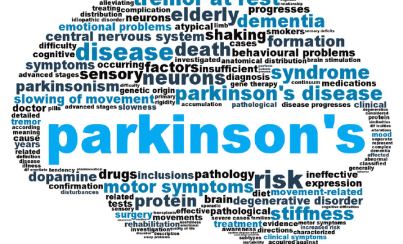

# Predicting Parkinson's Disease Using Voice Recordings
This project is coded in Python and the code can be found in the file Parkinson's Project Final.ipynb.

### Introduction
In this project we will study a Parkinson's Disease data set.
The dataset was created by Max Little of the University of Oxford, in collaboration with the National Centre for Voice and Speech, Denver, Colorado, who recorded the speech signals.
The original study published the feature extraction methods for general voice disorders.
The dataset is composed of a range of biomedical voice measurements from 31 people, 23 with Parkinson's disease (PD).
Each column in the table is a particular voice measure, and each row corresponds one of 195 voice recording from these individuals.
The main aim of the data is to discriminate healthy people from those with PD.
We will look at the different variables and try to predict if the person has Parkinson's or not.

### Method
We will use decision trees, random forests and K-neares neighbors. We evaluate our results using confusion matrices.

